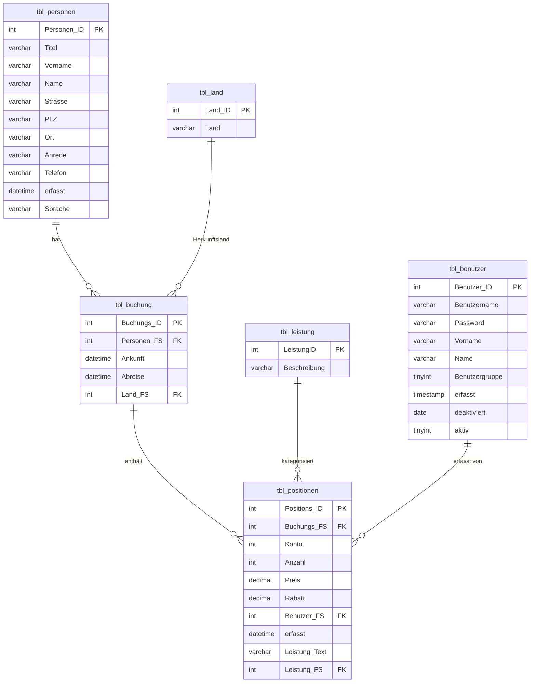

# ERD – Backpacker_LB3 (2. Normalform)

**Diagramm-Typ**: Entity-Relationship-Diagramm  
**Normalform**: 2NF (Zweite Normalform)  
**Stand**: 2026-06-23 – bereinigt auf InnoDB/FK, utf8mb4

---

## Mermaid-Diagramm (ER-Diagramm)

---

## Beziehungen (tabellarisch)

| Von | Zu | FK-Constraint | Kardinalität | Beschreibung |
|---|---|---|---|---|
| tbl_buchung.Personen_FS | tbl_personen.Personen_ID | fk_buchung_personen | N:1 | Buchung gehört zu einem Gast |
| tbl_buchung.Land_FS | tbl_land.Land_ID | fk_buchung_land | N:1 | Herkunftsland des Gastes (nullable) |
| tbl_positionen.Buchungs_FS | tbl_buchung.Buchungs_ID | fk_positionen_buchung | N:1 | Position gehört zu einer Buchung |
| tbl_positionen.Leistung_FS | tbl_leistung.LeistungID | fk_positionen_leistung | N:1 | Position referenziert eine Leistungskategorie |
| tbl_positionen.Benutzer_FS | tbl_benutzer.Benutzer_ID | fk_positionen_benutzer | N:1 | Position erfasst von einem Mitarbeiter |

---

## Anmerkungen zur Bereinigung

| Problem | Original | Bereinigt |
|---|---|---|
| Storage Engine | MyISAM | InnoDB (FK-Unterstützung) |
| Zeichensatz | latin1_general_ci | utf8mb4_unicode_ci |
| tbl_land PK | Kein PRIMARY KEY | Land_ID als PK definiert |
| tbl_positionen FULLTEXT | FULLTEXT KEY (MyISAM) | Entfernt (InnoDB-kompatibel) |
| deaktiviert DEFAULT | '1000-01-01' | NULL (sauberer, kein Dummy-Datum) |
| Fehlende UNIQUE | Kein UNIQUE auf Benutzername | uk_benutzername hinzugefügt |

---

## Grafisches ERD

Das Mermaid-Diagramm oben wird in GitHub direkt gerendert (GitHub rendert Mermaid-Blöcke in Markdown-Dateien automatisch).
