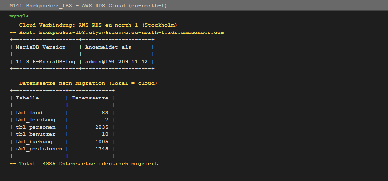
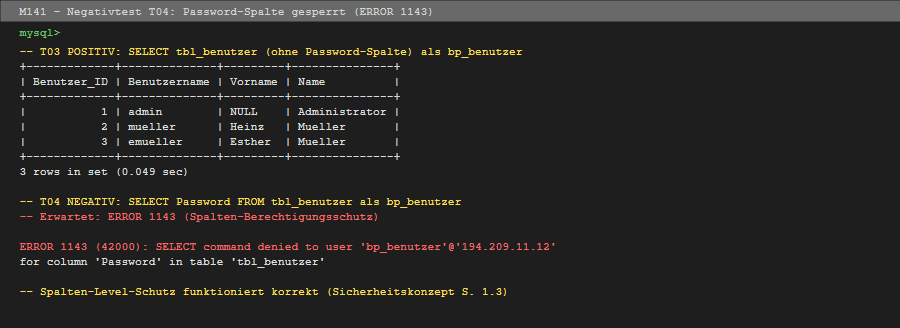

# Testprotokoll – Cloud-DBMS nach Migration (MS C & D)

**Datenbank**: backpacker_lb3  
**DBMS**: MariaDB 11.8.6-MariaDB-log (AWS RDS)  
**Datum**: 2026-06-23  
**Durchgeführt von**: Jann

---

## 1. Testumgebung

| Parameter | Wert |
|---|---|
| DBMS | MariaDB 11.8.6-MariaDB-log |
| Instanz-Typ | db.t3.micro |
| Cloud-Anbieter | AWS (Amazon Web Services) |
| Region | eu-north-1 (Stockholm) |
| Host / Endpoint | backpacker-lb3.ctyew6siuvwz.eu-north-1.rds.amazonaws.com |
| Port | 3306 |
| Testskripte | `tests/test_migration.sql`, `tests/test_berechtigungen.sql` |


*AWS RDS eu-north-1 – admin@194.209.11.12, alle 4885 Datensätze identisch migriert*

---

## 2. Cloud-DBMS Setup-Verifikation (MS C)

| Test-ID | Beschreibung | Erwartet | Ergebnis | OK? |
|---|---|---|---|---|
| C01 | RDS-Instanz erreichbar (Port 3306) | Verbindung möglich | Verbindung erfolgreich | ✅ |
| C02 | MariaDB-Version | MariaDB | 11.8.6-MariaDB-log | ✅ |
| C03 | Storage Engine = InnoDB (alle Tabellen) | InnoDB | InnoDB (6/6 Tabellen) | ✅ |
| C04 | Zeichensatz = utf8mb4 | utf8mb4_unicode_ci | utf8mb4_unicode_ci (alle Tabellen) | ✅ |
| C05 | Definierte Benutzer vorhanden | bp_benutzer, bp_management, bp_readonly | Alle 3 vorhanden | ✅ |

---

## 3. Migrationsprüfung – Datensätze (MS D)

| Tabelle | Lokal | Cloud | Identisch? |
|---|---|---|---|
| tbl_land | 83 | 83 | ✅ |
| tbl_leistung | 7 | 7 | ✅ |
| tbl_personen | 2'035 | 2'035 | ✅ |
| tbl_benutzer | 10 | 10 | ✅ |
| tbl_buchung | 1'005 | 1'005 | ✅ |
| tbl_positionen | 1'745 | 1'745 | ✅ |

**Alle 4'885 Datensätze identisch migriert.**

---

## 4. FK-Constraints auf Cloud

| Test-ID | Constraint | Erwartet | Ergebnis | OK? |
|---|---|---|---|---|
| T32a | fk_buchung_personen | Vorhanden | Vorhanden | ✅ |
| T32b | fk_buchung_land | Vorhanden | Vorhanden | ✅ |
| T32c | fk_positionen_buchung | Vorhanden | Vorhanden | ✅ |
| T32d | fk_positionen_leistung | Vorhanden | Vorhanden | ✅ |
| T32e | fk_positionen_benutzer | Vorhanden | Vorhanden | ✅ |

**Alle 5 FK-Constraints korrekt auf Cloud migriert.**

---

## 5. Berechtigungstest auf Cloud

| Test-ID | Typ | Beschreibung | Benutzer | Erwartet | Ergebnis | OK? |
|---|---|---|---|---|---|---|
| T01-C | ✅ Positiv | SELECT tbl_personen | bp_benutzer | Daten zurück | 2'035 Zeilen | ✅ |
| T03-C | ✅ Positiv | SELECT tbl_benutzer (ohne Password) | bp_benutzer | Daten zurück | 10 Zeilen | ✅ |
| T04-C | ❌ Negativ | SELECT Password | bp_benutzer | ERROR 1143 | ERROR 1143 (SELECT command denied for column 'Password') | ✅ |
| T05-C | ✅ Positiv | SELECT tbl_buchung | bp_benutzer | Daten zurück | 1'005 Zeilen | ✅ |
| T07-C | ✅ Positiv | SELECT tbl_land | bp_benutzer | Daten zurück | 83 Zeilen | ✅ |
| T09-C | ✅ Positiv | SELECT tbl_buchung | bp_management | Daten zurück | 1'005 Zeilen | ✅ |
| T11-C | ✅ Positiv | SELECT tbl_personen | bp_management | Daten zurück | 2'035 Zeilen | ✅ |

**Alle Berechtigungstests auf Cloud bestanden.**

---

## 6. Demo-Vorbereitung (LP)

| Punkt | Beschreibung | Status |
|---|---|---|
| 3 Benutzer auf Cloud verbindbar | bp_benutzer, bp_management, bp_readonly | ✅ |
| Zugriffsmatrix live demonstrierbar | T01-C bis T11-C per Skript ausführbar | ✅ |
| LP-Testskript vorbereitet | `tests/test_demo_lp.sql` bereit | ✅ |
| Negativtest Password live zeigbar | ERROR 1143 wird korrekt ausgegeben | ✅ |
| Backup vorhanden | `backup/backpacker_lb3_2026-06-23.sql` (848 KB) | ✅ |

**Demo-Verbindungsbefehle:**
```bash
# bp_benutzer
mysql -h backpacker-lb3.ctyew6siuvwz.eu-north-1.rds.amazonaws.com -u bp_benutzer -p backpacker_lb3

# bp_management
mysql -h backpacker-lb3.ctyew6siuvwz.eu-north-1.rds.amazonaws.com -u bp_management -p backpacker_lb3

# bp_readonly
mysql -h backpacker-lb3.ctyew6siuvwz.eu-north-1.rds.amazonaws.com -u bp_readonly -p backpacker_lb3
```


*T04 Negativtest: bp_benutzer kann Password-Spalte nicht lesen → ERROR 1143 (Spalten-Berechtigungsschutz aktiv)*

---

## 7. Fazit

Migration vollständig erfolgreich. Alle 4'885 Datensätze identisch auf AWS RDS vorhanden. Alle 5 FK-Constraints aktiv. Alle 3 Datenbankbenutzer korrekt mit Berechtigungen gemäss Zugriffsmatrix. Cloud-DBMS bereit für Demo vor Lehrperson.

---

