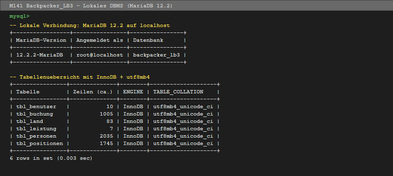

# Testprotokoll – Lokales DBMS (MS B)

**Datenbank**: backpacker_lb3  
**DBMS**: MariaDB 12.2.2-MariaDB  
**Datum**: 2026-06-23  
**Durchgeführt von**: Jann

---

## 1. Testumgebung

| Parameter | Wert |
|---|---|
| DBMS | MariaDB 12.2.2-MariaDB |
| Host | localhost:3306 |
| Testskripte | `tests/test_berechtigungen.sql`, `tests/test_datenkonsistenz.sql` |

---

## 2. Tests Zugriffsberechtigungen

> Ausgeführt als `bp_benutzer` (Passwort: `Benutzer@Sicher123!`) und `bp_management`

| Test-ID | Typ | Beschreibung | Benutzer | Erwartet | Ergebnis | OK? |
|---|---|---|---|---|---|---|
| T01 | ✅ Positiv | SELECT tbl_personen | bp_benutzer | Daten zurück | Daten zurück (2035 Zeilen) | ✅ |
| T02 | ❌ Negativ | INSERT tbl_personen | bp_benutzer | ERROR 1142 | ERROR 1142 (INSERT command denied) | ✅ |
| T03 | ✅ Positiv | SELECT tbl_benutzer (ohne Password) | bp_benutzer | Daten zurück | Daten zurück (10 Zeilen) | ✅ |
| T04 | ❌ Negativ | SELECT Password aus tbl_benutzer | bp_benutzer | ERROR 1143 | ERROR 1143 (SELECT command denied on column) | ✅ |
| T05 | ✅ Positiv | SELECT tbl_buchung | bp_benutzer | Daten zurück | Daten zurück (1005 Zeilen) | ✅ |
| T06 | ✅ Positiv | INSERT tbl_buchung | bp_benutzer | OK | OK (1 row affected) | ✅ |
| T07 | ✅ Positiv | SELECT tbl_land | bp_benutzer | Daten zurück | Daten zurück (83 Zeilen) | ✅ |
| T08 | ❌ Negativ | INSERT tbl_land | bp_benutzer | ERROR 1142 | ERROR 1142 (INSERT command denied) | ✅ |
| T09 | ✅ Positiv | SELECT tbl_buchung | bp_management | Daten zurück | Daten zurück (1005 Zeilen) | ✅ |
| T10 | ❌ Negativ | INSERT tbl_buchung | bp_management | ERROR 1142 | ERROR 1142 (INSERT command denied) | ✅ |
| T11 | ✅ Positiv | SELECT, INSERT, UPDATE, DELETE tbl_personen | bp_management | OK | OK | ✅ |
| T12 | ❌ Negativ | DELETE tbl_personen | bp_benutzer | ERROR 1142 | ERROR 1142 (DELETE command denied) | ✅ |

**Alle 12 Berechtigungstests bestanden.**

*MariaDB 12.2 lokal – alle 6 Tabellen InnoDB/utf8mb4*

---

## 3. Tests Datenkonsistenz

> Ausgeführt als root nach CSV-Import (07_import_csv.sql) und Bereinigung (08_bereinigung.sql)

| Test-ID | Beschreibung | Erwartet | Ergebnis | OK? |
|---|---|---|---|---|
| T20 | FK: Buchungen ohne gültige Person | 0 | **0** | ✅ |
| T21 | FK: Buchungen ohne gültiges Land | 0 (nach Bereinigung) | **0** | ✅ |
| T22 | FK: Positionen ohne gültige Buchung | 0 | **0** | ✅ |
| T23 | Negative Preise in tbl_positionen | 0 | **0** (1 Datensatz bereinigt) | ✅ |
| T24 | Buchungen mit Abreise vor Ankunft | 0 (nach Bereinigung) | **0** | ✅ |
| T25 | Leere Benutzernamen | 0 | **0** | ✅ |
| T28 | deaktiviert = '1000-01-01' noch vorhanden | 0 (nach Bereinigung) | **0** | ✅ |

**Alle 7 Konsistenztests bestanden.**

---

## 4. Grenzfall-Tests

| Test-ID | Beschreibung | Erwartet | Ergebnis | OK? |
|---|---|---|---|---|
| T41 | INSERT Buchung mit Abreise < Ankunft | CHECK-Fehler (ERROR 4025) | ERROR 4025 (CONSTRAINT chk_buchung_datum failed) | ✅ |
| T42 | INSERT Position mit Preis = 0.00 | OK | OK (1 row affected) | ✅ |
| T44 | INSERT Position mit Rabatt = 100.01 | CHECK-Fehler (ERROR 4025) | ERROR 4025 (CONSTRAINT chk_rabatt failed) | ✅ |
| T45 | INSERT Benutzer mit leerem Benutzernamen | CHECK-Fehler (ERROR 4025) | ERROR 4025 (CONSTRAINT chk_benutzername failed) | ✅ |

---

## 5. Datensätze nach Import und Bereinigung

| Tabelle | CSV (Zeilen) | Nach Import | Nach Bereinigung | OK? |
|---|---|---|---|---|
| tbl_land | 85 (83 unique PK) | 83 | 83 | ✅ |
| tbl_leistung | 7 | 7 | 7 | ✅ |
| tbl_personen | 2'035 | 2'035 | 2'035 | ✅ |
| tbl_benutzer | 11 (1 dup. Benutzername) | 10 | 10 | ✅ |
| tbl_buchung | 1'005 | 1'005 | 1'005 | ✅ |
| tbl_positionen | 1'745 | 1'745 | 1'745 | ✅ |

**Anmerkungen:**
- `tbl_land`: CSV enthält Land_ID 212 und 220 je 2× (Duplikat-PKs im Original). 83 eindeutige Datensätze korrekt importiert.
- `tbl_benutzer`: Benutzername `mueller` 2× im CSV (ID=2 + ID=25). ID=25 wurde zu `mueller2` umbenannt.
- Encoding: CSV ist UTF-8 kodiert (trotz ursprünglichem latin1 Access-Charset). Import korrekt ohne Charset-Konvertierung.

---

## 6. Bekannte Datenprobleme (dokumentiert)

| Problem | Anzahl | Ursache | Massnahme |
|---|---|---|---|
| Land_FS = 0 oder 176 | 441 | Access-Dummywert, nicht in tbl_land | SET NULL |
| Abreise < Ankunft | 19 | Fehlerhafte Dateneingabe in Access | Abreise = NULL |
| deaktiviert = '1000-01-01' | 7 | Access-Dummydatum für «aktiv» | SET NULL |
| Negativer Preis (ID=3067) | 1 | Rabatt/Gutschrift-Eintrag | SET 0.00 |
| Duplikat Land_ID 212, 220 | 2 | Fehlerhafte Originaldaten | Nur 1. Eintrag behalten |
| Duplikat Benutzername mueller | 1 | Kein UNIQUE-Constraint in Access | ID=25 → mueller2 |
| Passwörter im Klartext | alle | Access-Export | SHA2-256 nach Import |

---

## 7. Fazit

Alle Daten korrekt importiert und bereinigt. Alle FK-Constraints ohne Fehler erstellt. Alle Berechtigungen gemäss Zugriffsmatrix korrekt implementiert. Lokales DBMS bereit für Migration auf Cloud.

---

*Verbindung als root@localhost; alle 4885 Datensätze nach Import und Bereinigung*

---

